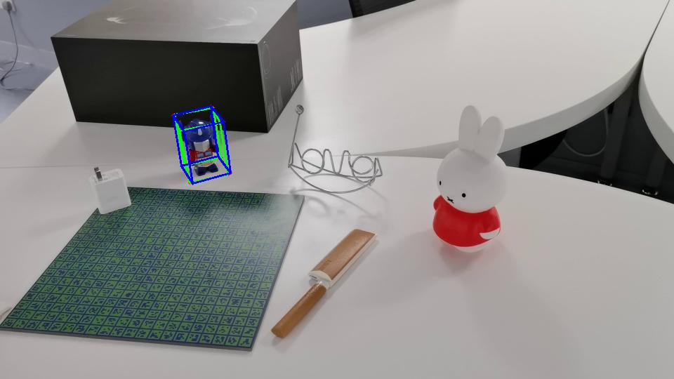
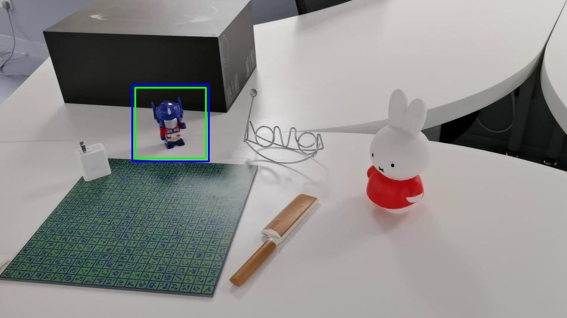
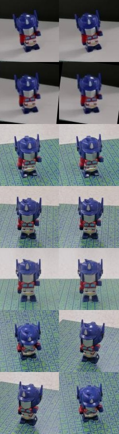
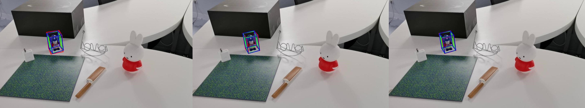

# Gen6D

Gen6D is able to estimate 6DoF poses for unseen objects like the following video.


## [Project page](https://liuyuan-pal.github.io/Gen6D/) | [Paper](https://arxiv.org/abs/2204.10776)

## Todo List

- [x] Pretrained models and evaluation codes.
- [x] Pose estimation on custom objects.
- [x] Training codes.

## Installation

Required packages are list in `requirements.txt`. To determine how to install PyTorch along with CUDA, please refer to the [pytorch-documentation](https://pytorch.org/get-started/locally/)

## Download

1. Download pretrained models, GenMOP dataset and processed LINEMOD dataset at [here](https://connecthkuhk-my.sharepoint.com/:f:/g/personal/yuanly_connect_hku_hk/EkWESLayIVdEov4YlVrRShQBkOVTJwgK0bjF7chFg2GrBg?e=Y8UpXu).
2. Organize files like
```
Gen6D
|-- data
    |-- model
        |-- detector_pretrain
            |-- model_best.pth
        |-- selector_pretrain
            |-- model_best.pth
        |-- refiner_pretrain
            |-- model_best.pth
    |-- GenMOP
        |-- chair 
            ...
    |-- LINEMOD
        |-- cat 
            ...
```

## Evaluation


```shell
# Evaluate on the object TFormer from the GenMOP dataset
python eval.py --cfg configs/gen6d_pretrain.yaml --object_name genmop/tformer

# Evaluate on the object cat from the LINEMOD dataset
python eval.py --cfg configs/gen6d_pretrain.yaml --object_name linemod/cat
```

Metrics about ADD-0.1d and Prj-5 will be printed on the screen.

### Qualitative results

3D bounding boxes of estimated poses will be saved in `data/vis_final/gen6d_pretrain/genmop/tformer`.
Ground-truth is drawn in green while prediction is drawn in blue.



Intermediate results about detection, viewpoint selection and pose refinement will be saved in `data/vis_inter/gen6d_pretrain/genmop/tformer`.



This image shows detection results.




This image shows viewpoint selection results.
The first row shows the input image to the selector. 
The second row shows the input images rotated by the estimated in-plane rotation (left column) or the ground-truth in-plane rotation(right column)
Subsequent 5 rows show the predicted (left) or ground-truth (right) 5 reference images with nearest viewpoints to the input image.



This image shows the pose refinement process.
The red bbox represents the input pose, the green one represents the ground-truth and the blue one represents the output pose for the current refinement step. 

## Pose estimation on custom objects

Please refer to [custom_object.md](custom_object.md)

## Training
1. Download processed [co3d](https://ai.facebook.com/datasets/CO3D-dataset/) data (co3d.tar.gz), [google scanned objects](https://arxiv.org/abs/2204.11918) data (google_scanned_objects.tar.gz) and [ShapeNet](http://shapenet.org/) renderings (shapenet.tar.gz) at [here](https://connecthkuhk-my.sharepoint.com/:f:/g/personal/yuanly_connect_hku_hk/EkWESLayIVdEov4YlVrRShQBkOVTJwgK0bjF7chFg2GrBg?e=Y8UpXu).
2. Download [COCO](https://cocodataset.org/#download) 2017 training set.
3. Organize files like
```shell
Gen6D
|-- data
    |-- GenMOP
        |-- chair 
            ...
    |-- LINEMOD
        |-- cat 
            ...
    |-- shapenet
        |-- shapenet_cache
        |-- shapenet_render
        |-- shapenet_render_v1.pkl
    |-- co3d_256_512
        |-- apple
            ...
    |-- google_scanned_objects
        |-- 06K3jXvzqIM
            ...
    |-- coco
        |-- train2017
```
4. Train the detector
```shell
python train_model.py --cfg configs/detector/detector_train.yaml
```
5. Train the selector
```shell
python train_model.py --cfg configs/selector/selector_train.yaml
```
6. Prepare the validation data for training refiner
```shell
python prepare.py --action gen_val_set \
                  --estimator_cfg configs/gen6d_train.yaml \
                  --que_database linemod/cat \
                  --que_split linemod_val \
                  --ref_database linemod/cat \
                  --ref_split linemod_val

python prepare.py --action gen_val_set \
                  --estimator_cfg configs/gen6d_train.yaml \
                  --que_database genmop/tformer-test \
                  --que_split all \
                  --ref_database genmop/tformer-ref \
                  --ref_split all 
```
This command will generate the information in the `data/val`, which will be used in producing validation data for the refiner.
7. Train the refiner
```shell
python train_model.py --cfg configs/refiner/refiner_train.yaml
```
8. Evaluate all components together.
```shell
# Evaluate on the object TFormer from the GenMOP dataset
python eval.py --cfg configs/gen6d_train.yaml --object_name genmop/tformer

# Evaluate on the object cat from the LINEMOD dataset
python eval.py --cfg configs/gen6d_train.yaml --object_name linemod/cat
```

### How to make a GenMOP object for evaluation

The process of making the GenMOP dataset is described as follows:
1. run SfM on the reference sequence using COLMAP.
2. run SfM on the test sequence using COLMAP. **Note the test sequence for evaluation need be captured in a static scene.**
3. Manually label at least 4 keypoints on two images from the query sequence and label the same 4 keypoints on two images from the test sequence. 
   For example, we label 4 keypoints on the frame40.jpg and frame620.jpg from the reference sequence of the `TFormer` object, which is stored in `aling-data/tformer-anno/ref-frame40(620)`.
   And we label 4 keypoints on the frame130.jpg and frame540.jpg from the test sequence of the `TFormer` object, which is stored in `aling-data/tformer-anno/test-frane130(540)`.
4. Compute the alignment poses and scale for two sequences and save the results in `align.pkl` in `tformer-test/`. We provide an example in `compute_align_poses.py`.
5. With `align.pkl`, you may use the `GenMOPDatabase` by `parse_database_name('genmop/tformer-que')` and `parse_database_name('genmop/tformer-que')`.

We use the annotation tools from https://github.com/luigivieira/Facial-Landmarks-Annotation-Tool to label keypoints for the GenMOP dataset.

## Acknowledgements
In this repository, we have used codes or datasets from the following repositories. 
We thank all the authors for sharing great codes or datasets.

- [PVNet](https://github.com/zju3dv/pvnet)
- [hloc](https://github.com/cvg/Hierarchical-Localization)
- [COLMAP](https://github.com/colmap/colmap)
- [ShapeNet](http://shapenet.org/)
- [COCO](https://cocodataset.org/#download)
- [Co3D](https://ai.facebook.com/datasets/CO3D-dataset/)
- [Google Scanned Objects](https://app.ignitionrobotics.org/GoogleResearch/fuel/collections/Google%20Scanned%20Objects)
- [MVSNet_pl](https://github.com/kwea123/MVSNet_pl)
- [AnnotationTools](https://github.com/luigivieira/Facial-Landmarks-Annotation-Tool)

We provide a paper list about recent generalizable 6-DoF object pose estimators at [https://github.com/liuyuan-pal/Awsome-generalizable-6D-object-pose](https://github.com/liuyuan-pal/Awsome-generalizable-6D-object-pose).

## Citation
```
@inproceedings{liu2022gen6d,
  title={Gen6D: Generalizable Model-Free 6-DoF Object Pose Estimation from RGB Images},
  author={Liu, Yuan and Wen, Yilin and Peng, Sida and Lin, Cheng and Long, Xiaoxiao and Komura, Taku and Wang, Wenping},
  booktitle={ECCV},
  year={2022}
}
```