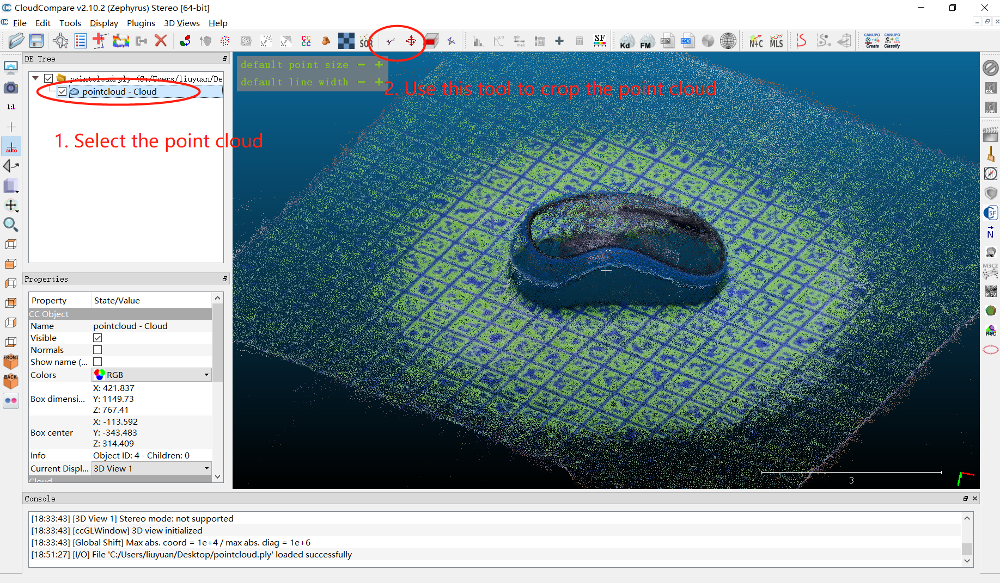
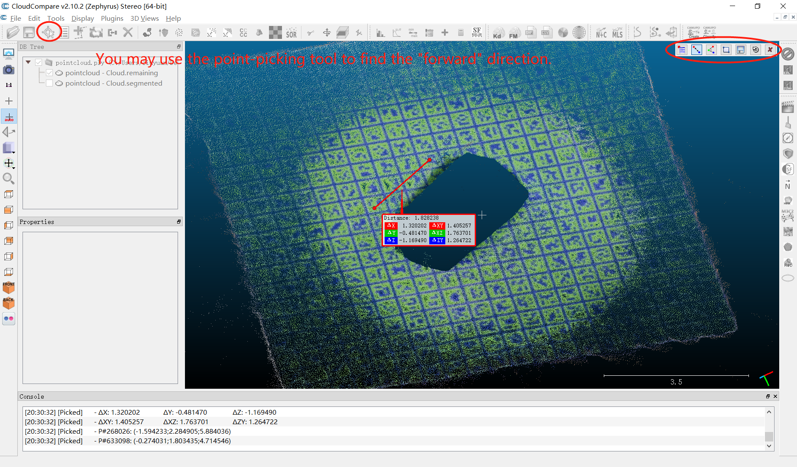
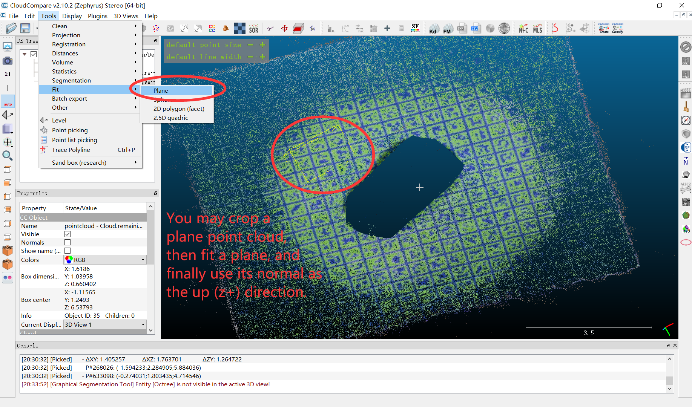

## Pose estimation on custom objects

In the following, we will generate reference images for a `mouse` object and predict its poses on new images using the pretrained Gen6D estimator.

1. Download a reference video and a test video for the `mouse` object at [here](https://connecthkuhk-my.sharepoint.com/:f:/g/personal/yuanly_connect_hku_hk/EkWESLayIVdEov4YlVrRShQBkOVTJwgK0bjF7chFg2GrBg?e=Y8UpXu) (mouse-ref.mp4/mouse-test.mp4). (The videos here are captured by my cellphone).
   Note when using your own video, please ensure that 
    1) the object in the reference video is static. 
    2) there is enough texture in the reference video for COLMAP to extract features for matching. 
       The object can be textureless but the background should contain enough texture so that COLMAP can successfully recover camera poses.
2. Organize files like
   ```
   Gen6D
   |-- data
       |-- custom
          |-- video
              |-- mouse-ref.mp4
              |-- mouse-test.mp4
   ```
3. Split the reference video into images
   ```shell
   # we save one image every 10 frames and maximum image side length is 960
   python prepare.py --action video2image \
                     --input data/custom/video/mouse-ref.mp4 \
                     --output data/custom/mouse/images \
                     --frame_inter 10 \
                     --image_size 960 \
                     --transpose
   ```
   We split the video `mouse-ref.mp4` into images saved in `data/custom/mouse/images`.
4. Run COLMAP SfM to recover camera poses.
   ```shell
   python prepare.py --action sfm --database_name custom/mouse --colmap <path-to-your-colmap-exe>
   ```
5. Manually specify the object region by cropping the point cloud of the object. 
   As an example, we use the [CloudCompare](https://www.cloudcompare.org/) to visualize and process the reconstructed point cloud from COLMAP.
   The reconstructed point cloud locates at `data/custom/mouse/colmap/pointcloud.ply`.
   
   Export the cropped point cloud as `object_point_cloud.ply`.
   
   Place the `object_point_cloud.ply` at `data/custom/mouse/object_point_cloud.ply`.
6. Manually specify the forward (x+) direction and the up (z+) direction for the object.
   
   
   For example, in my case, the x+ direction is (2.396784,-0.617233,0.282476) while the z+ is (-0.0452898,-0.550408,-0.833667).
   Write a `data/custom/mouse/meta_info.txt` with the content:
   ```shell
   2.396784 -0.617233 0.282476
   -0.0452898 -0.550408 -0.833667
   ```
   Your results may be different from mine since the reconstructed point cloud of COLMAP may have a different coordinate system.
7. Make sure that you have the following files, which are generated by above steps.
   ```shell
   Gen6D
   |-- data
       |-- custom
          |-- mouse
              |-- object_point_cloud.ply  # object point cloud
              |-- meta_info.txt           # meta information about z+/x+ directions
              |-- images                  # images
              |-- colmap                  # colmap project
   ```
   Then, predict poses for the test video.
   ```shell
   python predict.py --cfg configs/gen6d_pretrain.yaml \
                     --database custom/mouse \
                     --video data/custom/video/mouse-test.mp4 \
                     --resolution 960 \
                     --transpose \
                     --output data/custom/mouse/test \
                     --ffmpeg <path-to-ffmpeg-exe>
   ```
   You will see the video at `data/custom/mouse/test/video.mp4`.
8. (Optionally) You may directly download the reference images processed by me at [here](https://connecthkuhk-my.sharepoint.com/:f:/g/personal/yuanly_connect_hku_hk/EkWESLayIVdEov4YlVrRShQBkOVTJwgK0bjF7chFg2GrBg?e=Y8UpXu) (mouse_processed.tar.gz) and organize files like
   ```shell
   Gen6D
   |-- data
       |-- custom
          |-- mouse_processed
              |-- object_point_cloud.ply  # object point cloud
              |-- meta_info.txt           # meta information about z+/x+ directions
              |-- images                  # images
              |-- colmap                  # colmap project
   ```
   Then, predict poses from this processed reference images.
   ```shell
   python predict.py --cfg configs/gen6d_pretrain.yaml \
                     --database custom/mouse_processed \
                     --video data/custom/video/mouse-test.mp4 \
                     --resolution 960 \
                     --transpose \
                     --output data/custom/mouse_processed/test \
                     --ffmpeg <path-to-ffmpeg-exe>
   ```
   You will see the video like this
   
   
